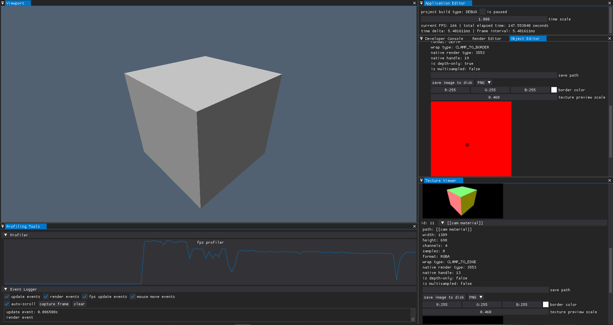

# MxEngineTemplate

This repository contains ready-to-use template project for [MxEngine](https://github.com/asc-community/MxEngine). You can edit
CMakeLists.txt to configure everything else for your needs. Below you can see the steps to build this project

### Installation
1. Fork this repository and clone on your machine via `git clone https://github.com/your-profile/MxEngineTemplate`
2. Install MxEngine and its dependencies: `git submodule update --init && cd MxEngine && git subdmodule update --init`
*Note: you can use git clone --recurse-submodules https://github.com/your-profile/MxEngineTemplate, but due to the circular
dependencies of EASTL library your git may fall into endless cloning cycle*
3. Install [Boost](https://boost.org) on your machine from website or by package manager. You may also need to set environment variable **BOOST_ROOT**
to be equal the Boost installation folder or provide **Boost_ROOOT** and **Boost_INCLUDE_DIR** in CMake if you are building on Windows
4. Build the project using CMake. Resulting executable will be output to the default build directory and to the root directory (for debugging)

